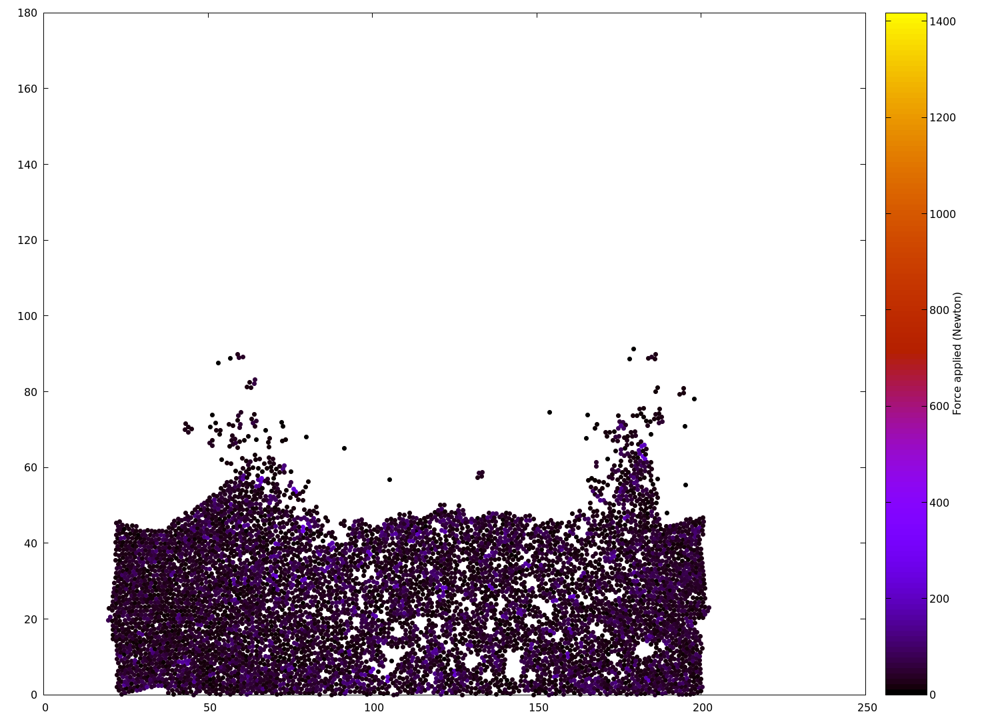
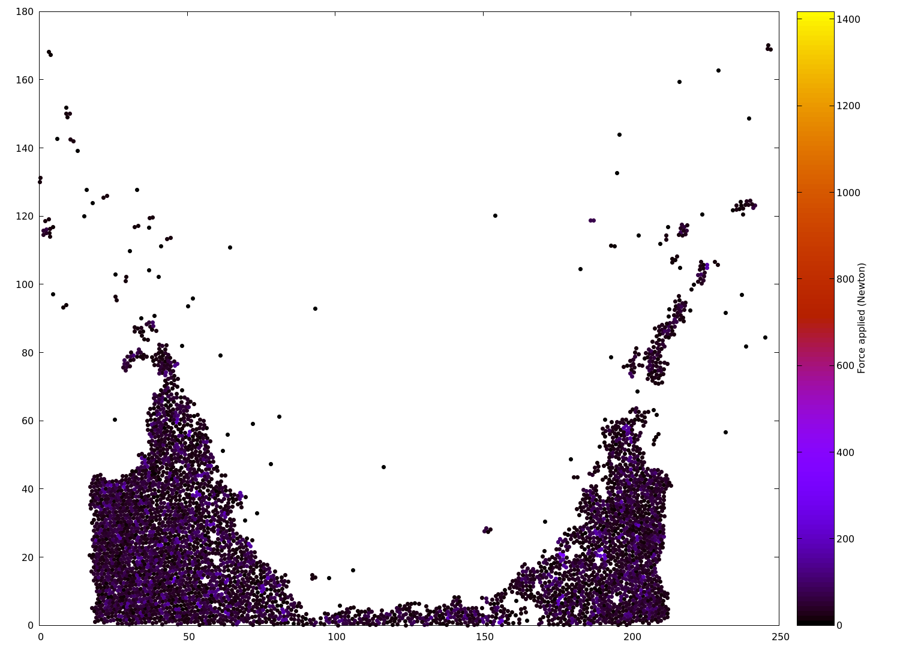

# README

Ce projet vise à développer un programme en C++ pour simuler des systèmes de particules.

Pour lire la documentation Doxygen complète, ouvrir le PDF dans le répertoire `docs` ou bien exécuter la commande suivant depuis la racine du projet :

```bash
    open docs/html/index.html
```


## Auteurs

Jules Roques (roquesj)  
Zephirin Faure (faurez)  


## Compilation

Lancer les commandes suivantes depuis la racine du projet pour le compiler :

```bash
    mkdir build
    cd build/
    cmake ..
    make
```


## Documentation

L'ensemble de la documentation du projet peut être parcourue à l'aide des fichiers générés par Doxygen (cf. intro).  
Pour plus d'information concernant la conception du code : [Conception](docs/conception.md).  
Pour chaque classe, méthode et attribut, la documentation propose les schémas expliquant les héritages, les appels, etc.  

## Utilisation

L'exécutable du code principal sera généré dans le répertoire `build/src` et peut être exécuter en effectuant la commande suivante depuis le répertoire `build` du projet :

```bash
    ./src/main
```


### Définition de l'univers

Pour définir le type d'univers et les particules de la simulation, modifier le corps du main dans `src/main.cpp`. Pourront y être définis :

1. **Les interactions** : Ce sont les forces qui s'exercent entre les particules. Ajouter des interactions entre particules en utilisant la méthode `addInteraction` de l'objet `universeGrid`. Par exemple :

    ```cpp
    universeGrid.addInteraction(
        [epsilon, sigma](const Particle& source, Particle& target) {
            lennardJonesInteraction(source, target, epsilon, sigma);
        }
    );
    ```

    Interractions possibles :

    - `gravitationalInteraction`
    - `lennardJonesInteraction`

2. **Les forces externes** : Ce sont les forces qui s'exercent sur les particules individuellement en fonction de leur position dans l'univers. Ajouter une force externe en utilisant la méthode `addExternalForce`. Par exemple :

    ```cpp
    universeGrid.addExternalForce(
        [G](Particle& target) {
            gravitationalForce(target, G);
        }
    );
    ```

    Forces externes possibles :

    - `gravitationalForce`
    - `wallsForce`


3. **Le type l'univers** : Définir les dimensions de l'univers en spécifiant les bornes inférieure et supérieure dans les vecteurs `lowerBound` et `upperBound` qui représentent chacun un sommet de l'univers. De plus l'univers peut être de deux types :

    - `finite_universe` : Un univers de taille finie dans lequel toutes les particules interragissent entre elles;
    - `gridded_universe` : Un univers de taille finie découpé en une grille de cellules telles que les particules n'interragissent qu'avec celles de la même cellule ou des cellules voisines.

4. **Les particules** : Ajouter des particules à l'univers en utilisant la méthode `addParticle`. Par exemple, pour ajouter des particules dans une région rectangulaire, utiliser une boucle imbriquée comme dans l'exemple suivant pour ajouter des particules rouges :

    ```cpp
    Vector bottomLeftCorner({100,60});
    for (size_t i = 0; i < red_width; i++) {
        for (size_t j = 0; j < red_height; j++) {
            Vector position = bottomLeftCorner;
            position += Vector({i * spaceStep, j * spaceStep});
            universeGrid.addParticle(position, red_speed, m);
        }
    }
    ```

5. **Les comportements aux limites** : Ce sont les conditions qui définissent le comportement des particules au bord de l'univers. Définir le comportement des particules lorsqu'elles atteignent les limites de l'univers avec la méthode `setLimitBehavior`. Il y a 3 comportements possibles :

    - `REFLEXION` : Les particules rebondissent sur les bords,
    - `ABSORPTION` : Les particules disparaissent,
    - `PERIODIC` : Les particules reviennent de l'autre côté de l'univers (uniquement pour `gridded_universe`).

6. **La simulation** : Configurer et lancer la simulation en utilisant la méthode `simulateStormerVerlet`, en spécifiant le pas de temps et le temps final de la simulation.


En suivant ces étapes, l'univers de simulation sera configurer et personnaliser les interactions et les forces appliquées aux particules pourront être personnalisées.


### Configuration

Le projet peut être configuré via le fichier `include/config.hpp`. Ce fichier contient les définitions de constantes permettant de personnaliser le comportement du programme en préprocesseur.  
Pour activer ou désactiver une fonctionnalité spécifique, commenter ou décommenter les lignes appropriées dans ce fichier.  
Voici une explication de chaque configuration :  

- `SHOW_PROGRESS_INFOS`: Lorsque activé, permet d'afficher des informations sur l'évolution du programme pendant son exécution.
  
- `NDEBUG`: Lorsque activé, toutes les assertions du programme sont désactivées, ce qui peut améliorer les performances en éliminant les vérifications supplémentaires pendant l'exécution. Cependant les erreurs potentielles ne seront pas détectées et signalées.
  
- `PNG_OUTPUT`: Lorsque activé, le programme génère la sortie dans un format d'images PNG, utile pour visualiser les résultats de manière graphique et générer ensuite une vidéo ou un gif.
  
- `XML_OUTPUT`: Lorsque activé, le programme génère la sortie au format XML, utile pour enregistrer les résultats dans un format structuré et lisible par machine, facilitant ainsi le traitement et l'analyse des données.
  

### Sortie

Le programme offre deux possibilités pour la sortie des données :

1. **Sortie PNG**  

    Lorsque l'option `PNG_OUTPUT` est activée dans le fichier de configuration, le programme génère un fichier ASCII `build/pastParticles.txt`. Ce fichier contient les positions et les forces des particules à chaque instant de la simulation. Ensuite, le programme utilise ces données pour générer un dossier d'images au format PNG `build/video`. Ce dossier contient 200 images, chacune représentant un instant de l'évolution de l'univers. Ces images peuvent être utilisées pour créer une vidéo ou un GIF animé de l'évolution de l'univers à l'aide de logiciels de montage vidéo ou de création de GIF.  

    Voici les commandes pour générer une vidéo ou un GIF à partir des images :
    
    ```bash
        # Pour générer une vidéo à partir des images PNG
        ffmpeg -framerate 30 -pattern_type glob -i 'video/*.png' -c:v libx264 -r 30 -pix_fmt yuv420p output.mp4
        
        # Pour générer un GIF à partir des images PNG
        ffmpeg -i 'video/img%03d.png' -vf "fps=10,scale=320:-1:flags=lanczos" -c:v pam -f image2pipe - | convert -delay 5 - -loop 0 -layers Optimize output.gif
    ```

|  |  |  |
| --------------------------- | --------------------------- | --------------------------- |

2. **Sortie XML (VTK)**  

    Lorsque l'option `XML_OUTPUT` est activée dans le fichier de configuration, le programme génère un dossier `build/VTKFiles`. Ce dossier contient un fichier au format VTK pour chaque pas de temps de la simulation. Chaque fichier VTK représente l'état de l'univers à un instant donné et peut être visualisé à l'aide de logiciels de visualisation de données tels que Paraview. Ces fichiers VTK permettent une analyse détaillée de l'évolution de l'univers et offrent une visualisation 3D interactive de la simulation.  

    Pour visualiser les données avec Paraview, ouvrez le logiciel et ouvrez un fichier `.xml` à partir du dossier `VTKFiles`. Vous pouvez ensuite explorer les données, les filtrer et les visualiser de différentes manières pour mieux comprendre l'évolution du système de particules au fil du temps.


## Tests

Pour tester les fonctionnalités de base de notre code, un exécutable de test utilisant Google Test (gtest) est généré dans le répertoire `build/test/test`. Cet exécutable permet de vérifier le bon fonctionnement des classes Vector et Particle implémentées.

Pour exécuter les tests, utiliser la commande suivante depuis le répertoire `build` du projet :

```bash
    ./test/test
```
